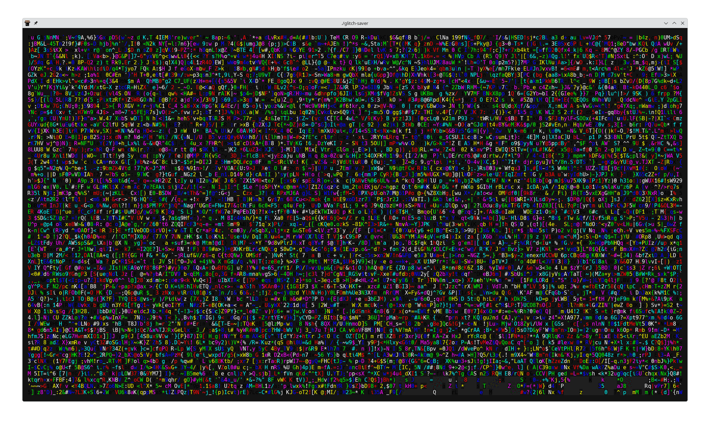

# Glitch Saver

A terminal-based glitch art screensaver written in Go.

This application takes over your terminal and displays a chaotic, animated
"glitch art" effect by rapidly drawing random characters, colors, and
distorted blocks of text.

## Showcase

Here's a glimpse of the glitch effects in action:



## Building

To build the application, you need to have Go installed.

```bash
go build -o glitch-saver ./cmd/app
```

## Running

Once built, you can run the screensaver with the following command:

```bash
./glitch-saver
```

To exit the screensaver, press `ESC` or `q`.

### Configuration

You can configure the speed and intensity of the glitch effect and the
character set using command-line flags. All effects can be combined for varied
visual experiences.

#### Core Settings

- `-fps`: Sets the frames per second for the animation. (Default: 30)
- `-intensity`: Controls the overall intensity of glitch effects (1-10).
Higher values mean more active glitches. (Default: 5)
- `-bg`: Enable random background coloring for an even more chaotic effect.
(Default: false)

#### Character Sets

- `-cp437`: Use Code Page 437 characters (block elements, symbols) for a retro,
text-mode art effect. This overrides the default alphanumeric set.
(Default: false)
- `-blocks`: Use only block characters (e.g., `░▒▓█`) for a heavy, block-based
glitch effect. This overrides both default and `-cp437` sets. (Default: false)

#### Glitch Effects

- `-scanline`: Enable the horizontal scanline glitch effect. (Default: false)
  - `-scanline-prob`: Probability (0.0-1.0) of a scanline appearing each frame.
(Default: 0.1)
  - `-scanline-intensity`: Intensity (1-10) of scanlines, affecting their
density. (Default: 5)
  - `-scanline-char`: Specific character to use for scanlines (e.g., `-`, `~`).
If empty, a random character from the current character set is used.
(Default: "")

- `-color-cycle`: Enable the color cycling effect, making certain drawn characters
slowly shift through colors. (Default: false)
  - `-color-cycle-speed`: Speed (1-10) at which colors cycle. (Default: 5)

- `-smear`: Enable character smearing/trails effect. New characters drawn may leave a fading trail. (Default: false)
  - `-smear-prob`: Probability (0.0-1.0) of a character starting to smear each
frame. (Default: 0.1)
  - `-smear-length`: Length of the smear trail in frames. (Default: 5)

- `-static`: Enable a full-screen TV noise/static burst effect. (Default: false)
  - `-static-prob`: Probability (0.0-1.0) of a static burst occurring each
frame. (Default: 0.01)
  - `-static-duration`: Duration of a static burst in frames. (Default: 3)
  - `-static-char`: Specific character to use for static bursts (e.g., `.`, `*`).
If empty, a random character from a default set (`.` `*`) is used.
(Default: "")

- `-scroll`: Enable the scrolling blocks effect, where sections of the screen scroll. (Default: false)
  - `-scroll-prob`: Probability (0.0-1.0) of a new scrolling block appearing
each frame. (Default: 0.05)
  - `-scroll-speed`: Speed of scrolling blocks. (Default: 1)
  - `-scroll-direction`: Direction of scrolling blocks (e.g., "horizontal",
"vertical", "random"). (Default: "random")

#### Color Themes

- `-theme`: Select a predefined color theme. Available themes: `default`,
`matrix`, `vaporwave`, `grayscale`. (Default: "default")

#### Theme Examples

```bash
# Use the matrix theme for green hacker-style colors
./glitch-saver -theme matrix

# Use the vaporwave theme for pastel colors
./glitch-saver -theme vaporwave

# Use the grayscale theme for monochrome effects
./glitch-saver -theme grayscale
```

### Examples

```bash
# Basic random alphanumeric glitches with default settings
./glitch-saver

# Slower animation, high intensity
./glitch-saver -fps 10 -intensity 10

# Retro text-mode art with random backgrounds
./glitch-saver -cp437 -bg

# Heavy block-based glitch with color cycling
./glitch-saver -blocks -color-cycle -color-cycle-speed 8

# Scanline effect with specific character, low intensity
./glitch-saver -scanline -scanline-char "=" -scanline-intensity 3

# Static burst effect
./glitch-saver -static

# Scrolling blocks effect
./glitch-saver -scroll -scroll-speed 2 -scroll-direction vertical

# Combine effects! (e.g., block chars, backgrounds, scanlines, and smearing)
./glitch-saver -blocks -bg -scanline -smear
```
